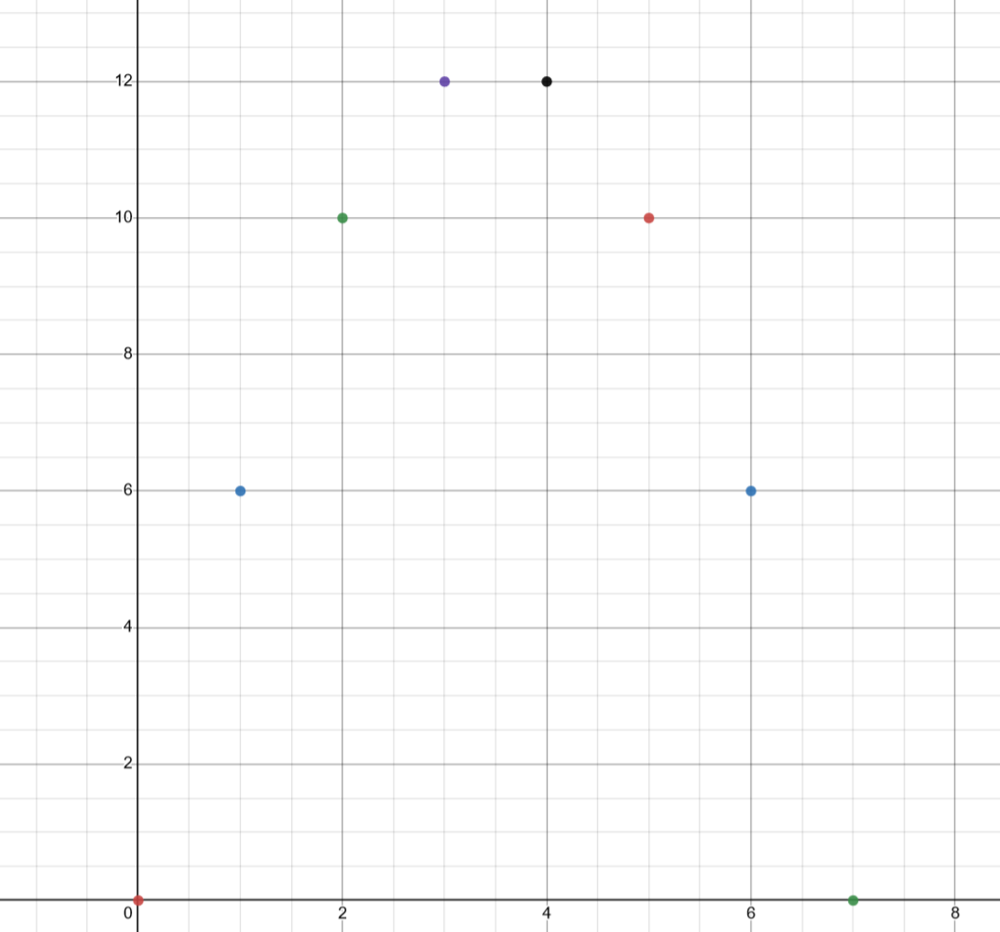
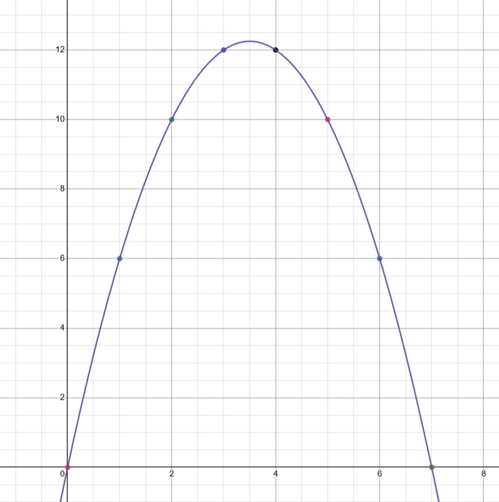
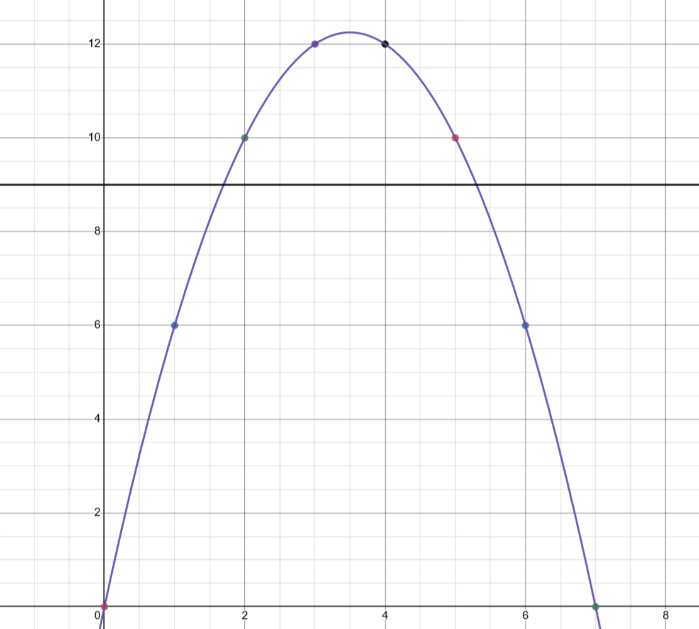

# Day 6

## Part 1: Problem

_a toy boat in a race can be charged by pressing a button on the top. each second spent charging the boat increases its speed throughout the race by 1 millimeter per second._

_a given race is defined by two numbers: the duration that the race lasts (in milliseconds), and the current best that any boat has moved (in millimeters):_

```
Time:      7  15   30
Distance:  9  40  200
```

_for any given race, there are a number of ways that one can hold the button down such that it beats the current best. for example, the 7ms race has 4 separate ways we can win (holding for 2s, 3s, 4s, and 5s)_

_what is the product of the number of ways every race can be run?_

## Part 1: Train of thought

let's take a look at the first example. the race lasts 7 ms, and the best distance so far is 9mm.

here's the plotting between the amount of time we hold down the button, and the distance the boat travels over the remaining time:



that looks familiar... in fact, this scatter plot exactly matches a perfect quadratic. here's $x^2 + 7x$ plotted over the same range:



the best distance is 9mm, so let's plot a straight line across this quadratic at $y = 9$:



we can see that there are four points along the quadratic that are above $y = 9$; we can translate the entire quadratic down by `9` in order to isolate these above the x-axis.

in other words, we'll have exactly four points between the two roots of the quadratic equation $x^2 + 7x - 9 = 0$.

if we solve the quadratic using the quadratic formula, we get two values:
`~5.303`, and `~1.697`. we're going to round the high and low roots of this quadratic to the `ceil()` and `floor()`, respectively. our new roots are 6 and 1. this expands the quadratic to the maximum size that only contains four points above the x-axis (i.e. $x=2$, $x=3$, $x=4$, $x=5$).

finally, we take the difference between the high and low roots, and subtract 1:

```
high - low - 1 -> 6 - 1 - 1 -> 4
```

with that, here's our game plan:

1. parse the input into a vector of times and best distances
2. for each time/distance pair, calculate the roots of the quadratic equation $-x^2 + \text{time}*x - \text{distance} = 0$
3. `ceil()` and `floor()` the high and low roots, respectively, to simplify the quadratic roots to the minimum size that contains all winning points above the x-axis.
4. take the difference between the high and low roots, and subtract 1.
5. multiply the result into a running product.

## Part 1: Implementation

in day 5, we used a `regex` to parse the input. we're going to do the same thing here. our regex pattern is:

```rust
let num_re = Regex::new(r"(\d+)").unwrap();
```

we'll use `capture_iter()` to get an iterator of matches for the two lines in the input file, and then we'll parse those into floating point numbers:

```rust
let times = num_re
  .captures_iter(input[0])
  .map(|x| x[1].parse::<f64>().unwrap())
  .collect::<Vec<f64>>();

let best = num_re
  .captures_iter(input[1])
  .map(|x| x[1].parse::<f64>().unwrap())
  .collect::<Vec<f64>>();
```

we'll create a mutable variable to hold the running product, and then iterate over the length of one of the vectors we just creates (they're the same length so it doesn't matter):

```rust
let mut mult = 1;

for i in 0..times.len() {
  // ...
}
```

we need to solve the quadratic equation given the time and best distance. we'll first extract our time and best from the vectors given the loop index.

```rust
let time = times[i];
let best = best[i];
```

for reference, the quadratic formula has the form

$$ x = \frac{-b \pm \sqrt{b^2 - 4ac}}{2a} $$

we can simplify this a little bit, since we know $a = -1$, $b = \text{time}$ $c = -\text{best}$:

$$ x = \frac{b \pm \sqrt{b^2-4c}}{2} $$

in code, we'll calculate the root component first, and then calculate both the high and low roots:

```rust
let rt = (time.powf(2.) - 4. * best).sqrt();

let high = (time + rt) / 2.;
let low = (time - rt) / 2.;
```

we'll calculate the different between the `ceil()` and `floor()` of the high and low roots, and subtract 1:

```rust
let diff = high.ceil() - low.floor() - 1.;
```

and then multiply that into our running product:

```rust
mult *= diff as u64;
```

and that's all there is to it! here's the full code:

```rust

use regex::Regex;

fn main() {
  let binding = std::fs::read_to_string("input.txt").unwrap();
  let input = binding.split("\n").collect::<Vec<&str>>();

  let num_re = Regex::new(r"(\d+)").unwrap();

  let times = num_re
    .captures_iter(input[0])
    .map(|x| x[1].parse::<f64>().unwrap())
    .collect::<Vec<f64>>();

  let best = num_re
    .captures_iter(input[1])
    .map(|x| x[1].parse::<f64>().unwrap())
    .collect::<Vec<f64>>();

  let mut mult = 1;

  for i in 0..times.len() {
    let t = times[i];
    let b = best[i];

    let rt = (t.powf(2.) - 4. * b).sqrt();

    let high = (t + rt) / 2.;
    let low = (t - rt) / 2.;

    let diff = high.ceil() as i64 - low.floor() as i64 - 1;

    mult *= diff;
  }

  println!("{}", mult);
}
```

that was definitely much easier than day 5 (i'm still trying to wrap my head around a better solution to part 2, but it is coming!)

## Part 2: Problem

_combine each row of numbers into a single number, and calculate the number of ways the boat can beat the best time._

## Part 2: Train of thought

we're working with 64-bit floating-point numbers, so at first glance we should actually be okay with just re-parsing the input in a different manner, and using that single huge number in our calculation. it might be a _little_ slow, but it should work just fine.

## Part 2: Implementation

let's rewrite the `time` and `best` regex parsing to get a single `f64` number. we'll start with the same `capture_iter()` to get an iterator of captures, map them to a vector of strings, flatten that into a single string, and then parse that into a `f64`.

```rust
let time = num_re
  .captures_iter(input[0])
  .map(|x| x[1].chars().collect::<Vec<_>>())
  .flatten()
  .collect::<String>()
  .parse::<f64>()
  .unwrap();

let best = num_re
  .captures_iter(input[1])
  .map(|x| x[1].chars().collect::<Vec<_>>())
  .flatten()
  .collect::<String>()
  .parse::<f64>()
  .unwrap();
```

there's definitely a better way to do this, but i still haven't totally figured out ownership and borrowing enough to work with something like `fold()`.

anyways, there's only a single number here, so we can remove the loop and just directly calculate the roots:

```rust
let rt = (time.powf(2.) - 4. * best).sqrt();

let high = (time + rt) / 2.;
let low = (time - rt) / 2.;

let diff = high.ceil() as i64 - low.floor() as i64 - 1;

println!("{}", diff);
```

and it actually works! i would have thought it'd be pretty slow, but it runs in about 2ms (which i'm honestly fine with).

here's the full code:

```rust
use regex::Regex;

fn main() {
  let binding = std::fs::read_to_string("input.txt").unwrap();
  let input = binding.split("\n").collect::<Vec<&str>>();

  let num_re = Regex::new(r"(\d+)").unwrap();

  let time = num_re
    .captures_iter(input[0])
    .map(|x| x[1].chars().collect::<Vec<_>>())
    .flatten()
    .collect::<String>()
    .parse::<f64>()
    .unwrap();

  let best = num_re
    .captures_iter(input[1])
    .map(|x| x[1].chars().collect::<Vec<_>>())
    .flatten()
    .collect::<String>()
    .parse::<f64>()
    .unwrap();

  let rt = (time.powf(2.) - 4. * best).sqrt();

  let high = (time + rt) / 2.;
  let low = (time - rt) / 2.;

  let diff = high.ceil() as i64 - low.floor() as i64 - 1;

  println!("{}", diff);
}
```

i'm lucky that today was relatively easy, because i need to study for exams :(
